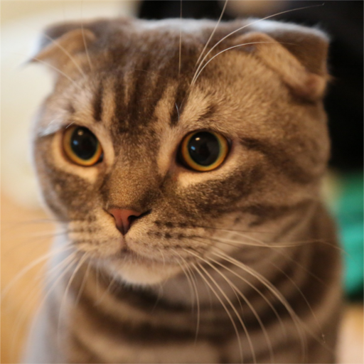
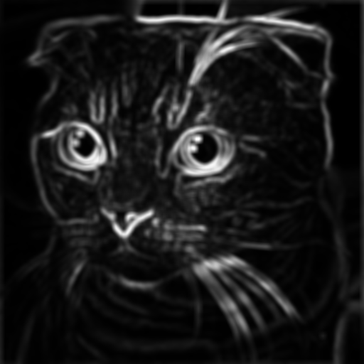
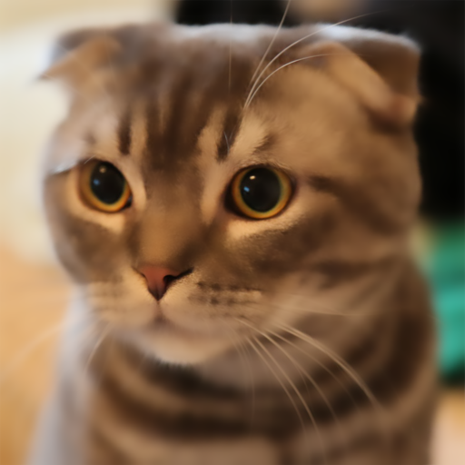
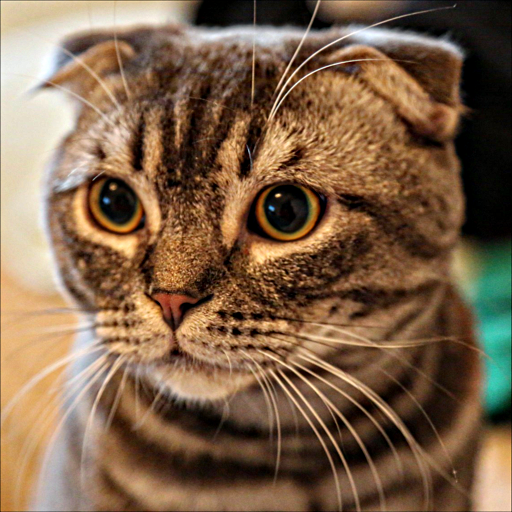

# Multi Scale image Decomposition

I forked this repo initially ment for MATLAB to write it again in python, Julia and with luck even make it a ImageJ extension. Is a very interesting Digital Filter. In short, **It smooths an image while preserving strong edges.**

- If a region has low variance, it’s likely smooth (sky, wall, etc.), so it gets blurred more.

- If a region has high variance (edges, textures), it’s likely important detail, so it’s preserved.

## Sub-window Variance Filter 

 First descoription of this filter is in the article [_Multi-scale Image Decomposition Using a Local Statistical Edge Model_](https://arxiv.org/abs/2105.01951). 
 For details go check the paper.

 |  |  
:---: | :---: | :---:  
*Input* | *Per-pixel preservation* (A) | *Filtered* (result)

 |
:---: |
*Both medium and fine details enhanced* |

## Python Implementation

The SVF smooths an image while preserving edges by analyzing local variance. Regions with low variance are blurred, while regions with high variance (edges) are preserved.

It decomposes an image into coarse (base), medium, and fine detail layers, then enhances those details using amplification factors.

